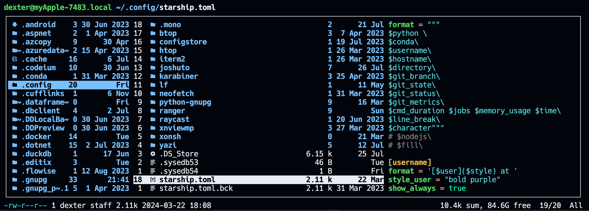
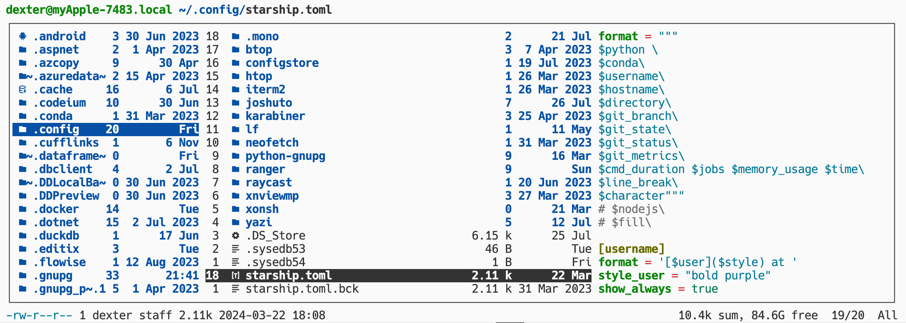
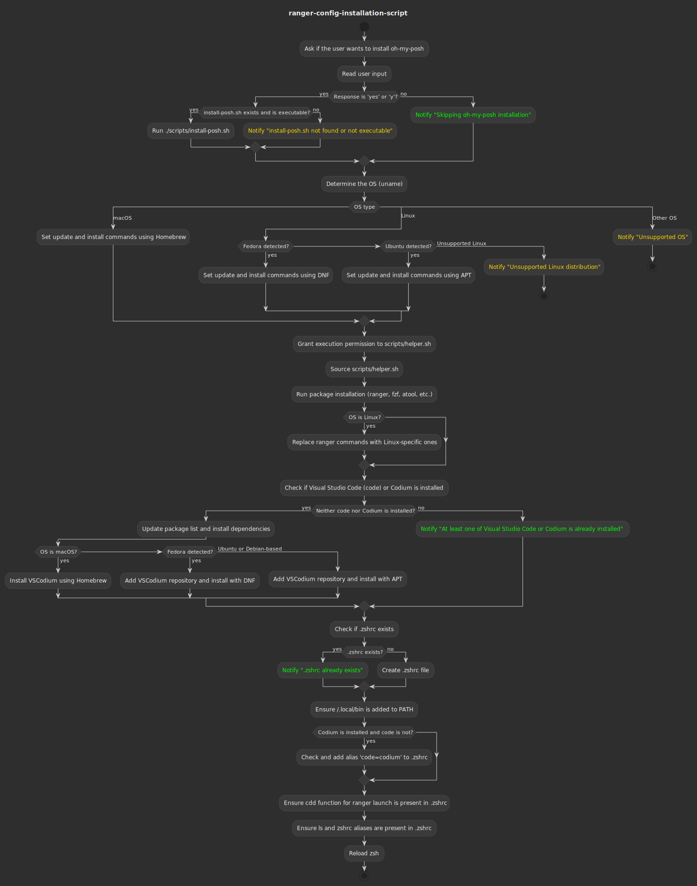

# ranger-config

## why


<!--  -->

⚖️ despite not the fastest, [ranger](https://ranger.github.io) is a very powerful and highly customizable terminal file manager.

🎯 this repo can do the following:

- install ranger and apply my version of the config on either
  - 
  -  (debian or fedora).
  - on [](https://microsoft.com/windows/): [WSL](https://docs.microsoft.com/en-us/windows/wsl/install) is needed

- ensure that some related tools are installed and integrated, most notably [codium](https://github.com/VSCodium/vscodium) if [](https://visualstudio.microsoft.com) isnt present
- on leaving ranger, current directory will the last visited
- optionally, oh-my-posh (https://ohmyposh.dev) can be installed on a fresh system

## usage

### prerequisites

**all os**
if nerdfonts are not installed, you might consider installing one like the _hack nerd font_:

```bash
wget -P ~/.local/share/fonts https://github.com/ryanoasis/nerd-fonts/releases/download/v3.2.1/Hack.zip \
 && cd ~/.local/share/fonts && unzip Hack.zip && rm *Windows* && rm Hack.zip && fc-cache -fv
```


have [brew](https://brew.sh) installed

```bash
# check if brew is installed
brew -v
# if no version is shown
/bin/bash -c "$(curl -fsSL https://raw.githubusercontent.com/Homebrew/install/HEAD/install.sh)"
```


[zsh](https://zsh.org) must be present

### installation

🚨 check if the 'ranger' folder exists. if so - create backup as `.zip` file of previous folder. no data is lost!

```bash
cd ~/.config
if [[ -d "$HOME/.config/ranger" ]]; then
    zip -r ranger.zip ranger && rm -rf ranger/
fi

git clone https://github.com/smeisegeier/ranger-config ~/.config/ranger/

cd ~/.config/ranger/
chmod +x install.sh
```

🚀 now the install script can be run. for what this does, refer to [details](README.md#install-script-details)

```bash
$HOME/.config/ranger/install.sh
```

🥂 type `cdd` in the terminal to launch ranger

## acknowledgements

this installation uses the great [ranger-devicons2](https://github.com/cdump/ranger-devicons2) plugin

## keymaps

### use cases

- file handling
  - `kk` to open file in code
  - `kf` to open in finder (macos)
  - `<enter>` to open with assigned program
  - `kw` to use wget
  - `ke` to execute shell script in ranger
  - `kd` to mount a drive letter in WSL _(⚠️ experimental)_
- filter and select files
  - `zf` -> filter str
  - `v` to select all files (toggle)
  - `uv` unselect all
  - `zf` -> enter to clear filter
- use bookmarks
  - `m` -> bookmark str to register
  - `b` -> bookmark str blink to bookmark
- show size
  - `lh` to show human readable size
  - `ls` to show mtime and size
  - `ld` to show devicons
  - `lp` to show permissions
- sort / order by size
  - `os` to sort by size
  - `om` to sort by modified date
- find files
  - `ff` -> find str to jump to file
  - `fz` -> use fuzzy search
- use tabs
  - `t2` to create and jump to new tab, `t-` to close tab
- use preview
  - `tab` toggle preview pane (disable on compute-heavy files like large db)
- copy paste
  - `yy` to copy file
  - `yp` to copy path
  - `yn` to copy filename
  - `pp` to paste
  - `po` to paste as overwrite
  - `pl` to paste _as symlink_
  - `pl` to paste _as hardlink_
- jump around
  - `12` -> `<arrow_up>` to jump 12 lines above
  - `gro` root
  - `gra` ~/.config/ranger
  - `gd` downloads
  - `gt` tmp
  - `gm` mnt (linux)
  - `gv` Volumes (macos)
  - `gg` github repos
  - `gb` bin (trash on macos)
  - `gf` follow symlink
- close task
  - `w` to see tasklist
  - -> `dd` to stop tasks
- zip / unzip
  - `kz` to zip files, optional: give dir name
  - `ku` to unzip files, optional: give dir name
- decrypt / encrypt
  - `kcd` to decrypt using keyring
  - `kce` to encrypt using keyring, choosing recipient

### all keys
### All Keys

| Key     | Meaning                                      | Comment                                        |
|---------|----------------------------------------------|------------------------------------------------|
| `Q`     | quitall!                                     |                                                |
| `q`     | quit _(in zsh: cd into last dir)_            |                                                |
| `F`     | set freeze_files!                            |                                                |
| `~`     | set viewmode! (1 or 3 pane)                  |                                                |
| `i`     | display_file                                 |                                                |
| `?`     | help                                         |                                                |
| `W`     | display_log                                  |                                                |
| `w`     | taskview_open                                | View task list                                 |
| `:`     | console                                      |                                                |
| `!`     | console shell%space                          |                                                |

### Change the Line Mode

| Key   | Meaning                      | Comment                        |
|-------|------------------------------|--------------------------------|
| `lf`  | linemode filename            |                                |
| `li`  | linemode fileinfo            |                                |
| `lm`  | linemode mtime               |                                |
| `lp`  | linemode permissions         |                                |
| `ls`  | linemode sizemtime           |                                |
| `lh`  | linemode sizehumanreadablemtime |                                |
| `lt`  | linemode metatitle           |                                |
| `ld`  | linemode devicons            |                                |

### Tagging / Marking

- 1 letter (#)tags for grouping files
- 1 letter (m)arks for (b)link targets

| Key       | Meaning                    | Comment                        |
|-----------|----------------------------|--------------------------------|
| `#<any>`  | tag_toggle tag=%any        |                                |
| `ut`      | tag_remove                 |                                |
| `<Space>` | mark_files toggle=True     |                                |
| `v`       | mark_files all=True toggle=True | Select all files (toggle)   |
| `uv`      | mark_files all=True val=False | Unselect all files          |
| `V`       | toggle_visual_mode         |                                |
| `uV`      | toggle_visual_mode reverse=True |                                |
| `m`       | add bookmark               | Register a bookmark            |
| `b`       | blink to bookmark          | Jump to a registered bookmark  |
| `um`      | unset bookmark             |                                |

### Jumping Around

| Key   | Meaning                | Comment                        |
|-------|------------------------|--------------------------------|
| `h`   | history_go -1          |                                |
| `j`   | history_go 1           |                                |
| `gh`  | cd ~                   |                                |
| `gt`  | cd ~/tmp               |                                |
| `gr`  | cd /                   |                                |
| `gg`  | cd ~/repos/github      |                                |
| `cd`  | console cd%space       |                                |

### Copy / Paste

| Key       | Meaning                          | Comment                        |
|-----------|----------------------------------|--------------------------------|
| `dd`      | cut                              |                                |
| `ud`      | uncut                            |                                |
| `yy`      | copy                             |                                |
| `ya`      | copy mode=add                    |                                |
| `yr`      | copy mode=remove                 |                                |
| `yt`      | copy mode=toggle                 |                                |
| `yp`      | yank path                        | Copy file path                 |
| `yd`      | yank dir                         |                                |
| `yn`      | yank name                        | Copy filename                  |
| `y.`      | yank name_without_extension      |                                |
| `pp`      | paste                            |                                |
| `po`      | paste overwrite=True             |                                |
| `pP`      | paste append=True                |                                |
| `pO`      | paste overwrite=True append=True |                                |
| `pl`      | paste_symlink relative=False     |                                |
| `pL`      | paste_symlink relative=True      |                                |
| `pl`      | paste_hardlink                   |                                |
| `pd`      | console paste dest=              |                                |

### Filesystem Operations

| Key       | Meaning                          | Comment                        |
|-----------|----------------------------------|--------------------------------|
| `=`       | chmod                            |                                |
| `kk`      | open_with code                   | Open file in code              |
| `kt`      | console touch%space              |                                |
| `km`      | console mkdir%space              |                                |
| `kf`      | open on finder (macos)           | Open in Finder (macOS)         |
| `kr`      | rename_append                    |                                |
| `kz`      | zip selection                    | Zip files, optional: give dir name |
| `ku`      | unzip selection                  | Unzip files, optional: give dir name |
| `kw`      | wget selection                   | Use wget                       |
| `kcd`     | decrypt file                     | Decrypt using keyring          |
| `kce`     | encrypt file                     | Encrypt using keyring, choosing recipient |
| `F2`      | rename_append                    |                                |
| `kr`      | rename_append                    |                                |
| `dD`      | console delete                   |                                |
| `x`       | console trash                    |                                |
| `du`      | shell -p du -d 1 -h -c           |                                |

### Search vs Find

| Key   | Meaning                | Comment                        |
|-------|------------------------|--------------------------------|
| `ff`  | console search%space   | Find files with a search term  |
| `fz`  | fuzzy search fzf       | Use fuzzy search               |
| `n`   | search_next            |                                |
| `N`   | search_next forward=False |                                |
| `ct`  | search_next order=tag  |                                |
| `cs`  | search_next order=size |                                |
| `ci`  | search_next order=mimetype |                                |
| `cc`  | search_next order=ctime |                                |
| `cm`  | search_next order=mtime |                                |
| `ca`  | search_next order=atime |                                |

### Tabs

| Key   | Meaning                | Comment                        |
|-------|------------------------|--------------------------------|
| `t+`  | tab_new                |                                |
| `t-`  | tab_close              |                                |
| `t1`  | tab_open 1             |                                |
| `t2`  | tab_open 2             | Create and jump to a new tab   |
| `t3`  | tab_open 3             |                                |
| `t4`  | tab_open 4             |                                |

### Sorting

| Key   | Meaning                                         | Comment                        |
|-------|-------------------------------------------------|--------------------------------|
| `on`  | chain set sort=natural; set sort_reverse=False  |                                |
| `or`  | set sort_reverse!                               |                                |
| `os`  | chain set sort=size; set sort_reverse=False     | Sort by size                   |
| `ob`  | chain set sort=basename; set sort_reverse=False |                                |
| `om`  | chain set sort=mtime; set sort_reverse=False    | Sort by modified date          |
| `oc`  | chain set sort=ctime; set sort_reverse=False    |                                |
| `oa`  | chain set sort=atime; set sort_reverse=False    |                                |
| `ot`  | chain set sort=type; set sort_reverse=False     |                                |
| `oe`  | chain set sort=extension; set sort_reverse=False|                                |
| `oS`  | chain set sort=size; set sort_reverse=True      |                                |
| `oB`  | chain set sort=basename; set sort_reverse=True  |                                |
| `oN`  | chain set sort=natural; set sort_reverse=True   |                                |
| `oM`  | chain set sort=mtime; set sort_reverse=True     |                                |
| `oC`  | chain set sort=ctime; set sort_reverse=True     |                                |
| `oA`  | chain set sort=atime; set sort_reverse=True     |                                |
| `oT`  | chain set sort=type; set sort_reverse=True      |                                |
| `oE`  | chain set sort=extension; set sort_reverse=True |                                |

### Settings

| Key    | Meaning                       | Comment                        |
|--------|-------------------------------|--------------------------------|
| `zf`   | console filter%space          | Filter string                  |
| `zp`   | set preview_files!            |                                |
| `zi`   | set preview_images!           |                                |
| `zc`   | set collapse_preview!         |                                |
| `zd`   | set sort_directories_first!   |                                |
| `

## install script details

